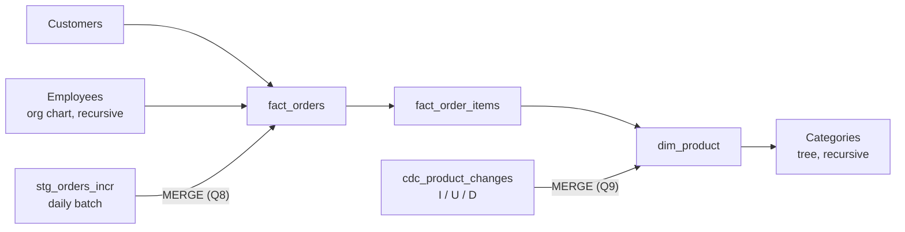

# Voltkart: The Modern SQL Challenge

Advanced SQL for modern data engineering on **SQL Server (T-SQL, run in SSMS)**: window analytics, recursive hierarchies, incremental loading with `MERGE`, change data capture and query tuning.

---

## 1. The business

Voltkart is a fast-growing online electronics and appliances retailer in India. It sells everything from gaming laptops to air conditioners across the country, and it has grown from a niche store to **millions of orders**.

The data team is feeling the strain:

- The nightly job **rebuilds the reporting tables with full reloads**, which has become slow and fragile.
- The analytics team keeps asking for reports the current setup struggles to produce: **running revenue trends**, **per-category rollups** across a deep product hierarchy, **customer-retention streaks**, and **team performance up the sales org**.

Leadership wants two things:

1. **Reporting that answers real questions.**
2. **A reliable incremental load** that only touches what changed, instead of rebuilding everything each night.

---

## 2. The challenge

Aarti, Voltkart's Data Engineering lead, is hiring engineers who can do modern SQL properly: not just `SELECT`s, but **window analytics**, **recursive hierarchies** and **change-driven loading with `MERGE`**.

The task is to do two things, all in T-SQL on SQL Server:

1. **Answer a set of analytical questions** (11 questions, warm-up to stretch).
2. **Build the incremental and change-data-capture load logic.**

Estimated effort: 2 to 3 evenings.

---

## 3. The data

A small relational schema, a copy of the Voltkart schema:

| Table | What it holds |
|---|---|
| `fact_orders` | One row per order: customer, sales rep, date, status, total |
| `fact_order_items` | One row per order line (`line_amount` and the product sold) |
| `stg_orders_incr` | Daily staging batch of new and changed orders |
| Customers | Customer details including `signup_date` |
| `dim_product` | Product catalogue, linked to a category |
| Categories | Product category tree (recursive parent-child) |
| Employees | Sales org chart (recursive manager-to-report) |
| `cdc_product_changes` | Change feed for products, with operation codes `I`, `U` and `D` |



> The full data dictionary is in a separate document (document 04) that was not available when this README was written. The table list above is taken from the problem statement and the questions, so check exact table and column names against the dictionary before running anything.

### Key rule

Use **`order_status = 'Completed'`** for all revenue and performance questions, unless a question says otherwise.

---

## 4. The questions

The questions build up: warm-up first, then core, then stretch.

### Warm-up

| # | Ask | Required output | Main technique |
|---|---|---|---|
| 1 | Top 20 completed orders by value, with customer and sales rep | `order_id`, `order_date`, `customer_name`, `sales_rep_name`, `order_total` | Joins, `TOP`, ordering |
| 2 | Customers who never placed an order | `customer_id`, `customer_name`, `signup_date` | Anti-join (`NOT EXISTS` or `LEFT JOIN`) |
| 3 | Top 3 products by completed revenue in every category | `category_name`, `product_name`, `total_revenue`, `revenue_rank` | Ranking window functions with `PARTITION BY` |

### Core

| # | Ask | Required output | Main technique |
|---|---|---|---|
| 4 | Monthly completed revenue with a running total and month-over-month % change | `order_month` (YYYY-MM), `monthly_revenue`, `running_total`, `mom_pct_change` | `SUM() OVER`, `LAG` |
| 5 | Customers split into four quartiles by lifetime completed spend, with count and average spend per quartile | `spend_quartile`, `customer_count`, `avg_lifetime_spend` | `NTILE(4)` |
| 6 | Every category in the subtree rooted at 'Computers', at any depth, with depth and a readable path | `category_id`, `category_name`, `depth_level`, `category_path` | Recursive CTE |
| 7 | Total completed order value for every employee's whole team (themselves plus everyone under them) | `employee_id`, `employee_name`, `role`, `team_total_revenue` | Recursive CTE and aggregation up the org chart |
| 8 | Incremental load of `stg_orders_incr` into `fact_orders` | Single `MERGE`, plus verification | `MERGE`: update changed, insert new |

### Stretch

| # | Ask | Required output | Main technique |
|---|---|---|---|
| 9 | Apply `cdc_product_changes` to `dim_product`: `I` inserts, `U` updates, `D` deletes | Single `MERGE`, plus verification | `MERGE` with operation codes |
| 10 | Fix a slow report: explain the plan, rewrite the query, add an index | Rewritten query, `CREATE INDEX`, note with logical reads before and after | Execution plans, `STATISTICS IO`, indexing |
| 11 | (Bonus) Longest run of consecutive calendar months with at least one completed order, per customer | `customer_id`, `customer_name`, `longest_streak_months` | Gaps and islands |

### Special requirements

**Question 8 (incremental `MERGE`)**
- One `MERGE` statement.
- Matched orders are updated (status and total) and new orders are inserted.
- Include a verification query showing the `fact_orders` row count before versus after, and a sample of updated rows.

**Question 9 (CDC `MERGE`)**
- One `MERGE` statement that handles all three operations (`I`, `U`, `D`).
- Include a verification query showing the inserted, updated and deleted products.

**Question 10 (performance tuning)**

The slow query analysts run:

```sql
SELECT o.customer_id, COUNT(*) AS orders_2024,
       (SELECT SUM(oi.line_amount)
        FROM fact_order_items oi
        JOIN fact_orders o2 ON o2.order_id = oi.order_id
        WHERE o2.customer_id = o.customer_id) AS lifetime_value
FROM fact_orders o
WHERE YEAR(o.order_date) = 2024
GROUP BY o.customer_id;
```

Turn on `SET STATISTICS IO, TIME ON` and **Include Actual Execution Plan**, run it, then make it fast. Deliver:
1. An explanation of what the plan is doing.
2. The rewritten query.
3. The `CREATE INDEX` statement(s).
4. A short note with logical reads before versus after and why the plan changed.

## 7. Skills practised

- Window functions: ranking, running totals, `LAG`, `NTILE`
- Recursive CTEs over category and org-chart hierarchies
- Incremental loading with `MERGE`
- Change data capture with insert, update and delete operation codes
- Query tuning: reading the actual execution plan, `STATISTICS IO`, rewriting queries and indexing
- Gaps-and-islands analysis for streaks

---

## 8. Tech stack

- SQL Server (T-SQL)
- SQL Server Management Studio (SSMS)

---

## 9. Progress checklist

- [ ] Q1 Top 20 completed orders
- [ ] Q2 Customers who never ordered
- [ ] Q3 Top 3 products per category
- [ ] Q4 Monthly revenue trend
- [ ] Q5 Spend quartiles
- [ ] Q6 Category subtree under 'Computers'
- [ ] Q7 Team revenue up the org chart
- [ ] Q8 Incremental `MERGE` into `fact_orders` with verification
- [ ] Q9 CDC `MERGE` into `dim_product` with verification
- [ ] Q10 Query tuning with logical reads before and after
- [ ] Q11 (Bonus) Loyalty streaks
